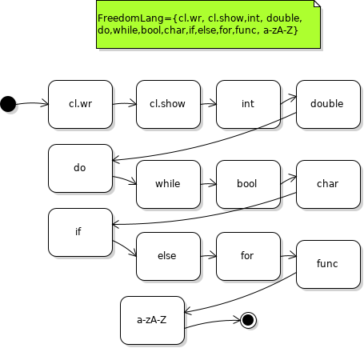
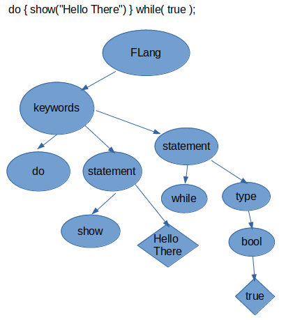

# Mathematical Basis of Freedom Language ( Discrete math)
## Automatic Grammar
FreedomLang={cl.wr, cl.show,int, double, 
do,while,bool,char,if,else,for,func, a-zA-Z}

[S -> wr A](#) 
[A -> show B](#) 
[B -> int C](#) 
[C -> double D](#) 
[D -> do E](#) 
[E -> while F](#) 
[F -> bool T](#) 
[T -> char R](#) 
[R -> if Y](#) 
[Y -> else L](#) 
[L -> for K](#) 
[K -> func U](#) 
[U -> a-zA-Z](#) 
## Determined finite state machine
 
## Context Free Grammar
[<FLang>::=<identificator|type|variable|keywords|statements](#) 
[<indentificator>::=<'a'...'z'|'A'...'Z'>](#) 
[<type>::=< int|bool|char|double|func >](#) 
[<bool>::=<true|false>](#) 
[<variable>::=<type|identificator >](#) 
[<keywords>::=<show|wr|if|else|do|while>](#) 
[<statement>::=<keywords|()>](#) 
## Syntax three for: 
[do { cl.show("Hello There") } while( true );](#) 
 
Go back to [Home page](README.md) 
